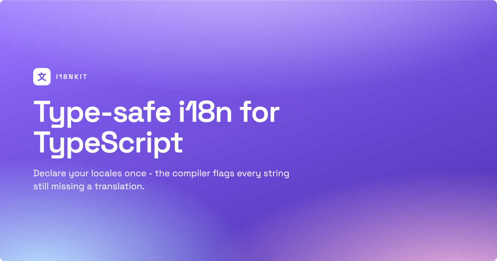

# i18nkit



**Universal, 100% type-safe i18n for TypeScript sites.** Declare your locales once and the compiler
guarantees every string is translated into every language - add a locale and TypeScript lights up at
every translation you still owe.

- **Type-safe by construction** - a translation is an object with one entry per locale. Miss one and it is a compile error, not a runtime `undefined`.
- **Framework-agnostic core** - zero dependencies, no `next`, no `react`. Runs on the server, in the browser, and at the edge.
- **Optional React layer** - a provider, hooks, an accessible `<LanguagePicker>`, and a locale-aware `<LocaleLink>` (decoupled from any router).
- **Parameterized text** - per-locale builder functions keep word order correct in every language.
- **Locale detection & URL routing** included - `Accept-Language` matching, cookie resolution, and "default at bare URL, others under `/nl/…`" helpers.

```ts
// Add "de" to your locales...
const i18n = new I18n({
    locales: { en: { label: "English" }, nl: { label: "Nederlands" }, de: { label: "Deutsch" } },
    default: "en",
});

// ...and every catalog missing a German string is now a compile error:
i18n.defineTextCatalog({
    title: { en: "Customers", nl: "Klanten" },
    //     ~~~~~ Property 'de' is missing
});
```

---

## Install

```bash
npm install @daanvandenbergh/i18nkit
```

`react` / `react-dom` are optional peer dependencies - you only need them if you use the `/react` entry.

## Install the Claude Code skills

i18nkit ships two agent skills:

- **`i18nkit-sweep`** - sweeps your source for user-facing strings that bypass the type-safe system
  (and, if you use `@daanvandenbergh/scribekit`, checks every post has a translation and its own
  localized hero for each locale). Report-only by default; run it with `/i18nkit-sweep`.
- **`i18nkit-add-locale`** - adds a new language: edits your `I18n` config, then compiler-drives the
  translation of every catalog entry `tsc` flags (plus scribekit posts and hardcoded locale lists).
  Run it with `/i18nkit-add-locale`.

Wire them into Claude Code with **symlinks**, so they track the installed package version - an
`npm update` keeps the skills current, with no copy to re-sync:

```bash
mkdir -p .claude/skills
# from your project root (assumes .claude/skills/ and node_modules/ share this root):
for skill in i18nkit-sweep i18nkit-add-locale; do
    ln -s "../../node_modules/@daanvandenbergh/i18nkit/skills/$skill" ".claude/skills/$skill"
done
```

If your layout differs, point the links at an absolute target resolved by node:

```bash
pkg="$(dirname "$(node -p "require.resolve('@daanvandenbergh/i18nkit/package.json')")")"
for skill in i18nkit-sweep i18nkit-add-locale; do
    ln -s "$pkg/skills/$skill" "$(pwd)/.claude/skills/$skill"
done
```

Verify with `ls .claude/skills/i18nkit-sweep/SKILL.md .claude/skills/i18nkit-add-locale/SKILL.md`, then
invoke `/i18nkit-sweep` or `/i18nkit-add-locale` in Claude Code. (The targets exist once you have run
`npm install`.) Developing against a local checkout of this repo? Link the source folders instead:
`ln -s ../../skills/$skill .claude/skills/$skill`.

## Set up once

Create your locale set in one place and export the instance (and its `Locale` type):

```ts
// app/i18n.ts
import { I18n } from "@daanvandenbergh/i18nkit";

export const i18n = new I18n({
    locales: {
        en: { label: "English",    htmlLang: "en", locale: "en-GB" },
        nl: { label: "Nederlands", htmlLang: "nl", locale: "nl-NL" },
    },
    default: "en",
});

export type Locale = keyof typeof i18n.locales; // "en" | "nl"
```

`htmlLang` (for `<html lang>` / URL prefixes) and `locale` (for `Intl` formatting) each default to the
locale's key, so a BCP-47-keyed config can be as short as `en: { label: "English" }`.

## Write translations

Author catalogs through the instance. Every entry must cover every locale, checked at the call site:

```ts
// app/customers/text.ts
import { i18n } from "../i18n";

export const TX = i18n.defineTextCatalog({
    title:   { en: "Customers", nl: "Klanten" },
    // Parameterized text: a builder per locale keeps word order native to each language.
    deleted: { en: (name: string) => `${name} deleted`, nl: (name: string) => `${name} verwijderd` },
    range:   {
        en: (from: number, to: number, total: number) => `Showing ${from}-${to} of ${total}`,
        nl: (from: number, to: number, total: number) => `${from}-${to} van ${total} weergegeven`,
    },
});
```

## Resolve to strings

Bind a translator to a locale and call it:

```ts
const translate = i18n.translator("nl");

translate(TX.title);            // "Klanten"
translate(TX.deleted, "Ada");   // "Ada verwijderd"
translate(TX.range, 1, 20, 137); // "1-20 van 137 weergegeven"
```

For a one-off, skip the binding: `i18n.translate(TX.title, "nl")`. For a string that is the same in
every language, `i18n.uniform("Acme")` builds a fully-covered entry. For a standalone parameterized
string, `i18n.defineText({ en: (n) => …, nl: (n) => … })` enforces coverage and infers the arguments.

## Detect the locale (server / SSR)

The core is framework-agnostic: feed it whatever your framework gives you.

```ts
// Anywhere you have the request: a cookie value and/or the Accept-Language header.
// A stored cookie choice wins; a first-time visitor (no cookie) gets their browser preference.
// Both helpers fall back to `default` internally, so gate on the cookie's presence - don't
// chain them with `??`/`||` (resolveLocale never returns nullish, so the fallback is dead code).
const locale = cookieValue
    ? i18n.resolveLocale(cookieValue)                 // honor the stored choice
    : i18n.matchAcceptLanguage(acceptLanguageHeader); // else the visitor's preference
```

For example, in a Next.js Server Component:

```ts
import { cookies, headers } from "next/headers";
import { i18n } from "@/app/i18n";

export async function activeLocale() {
    const cookie = (await cookies()).get(i18n.cookie)?.value;
    const accept = (await headers()).get("accept-language");
    return cookie ? i18n.resolveLocale(cookie) : i18n.matchAcceptLanguage(accept);
}
```

## React

Wrap your app in the provider, passing the resolved locale and what to do when it changes (the provider
writes the locale cookie for you first, then calls `onChange` - do the navigation there):

```tsx
// app/providers.tsx
"use client";
import { usePathname, useRouter } from "next/navigation";
import { I18nProvider } from "@daanvandenbergh/i18nkit/react";
import "@daanvandenbergh/i18nkit/styles.css"; // for <LanguagePicker>
import { i18n } from "./i18n";

export function Providers({ locale, children }) {
    const router = useRouter();
    const pathname = usePathname();
    // URL-routed site (the default): the path prefix decides the locale, so navigate to the new
    // locale's URL. Writing the cookie alone would NOT switch locale on an already-prefixed page.
    return (
        <I18nProvider
            i18n={i18n}
            locale={locale}
            onChange={(next) => router.push(i18n.switchLocalePath(pathname, next))}
        >
            {children}
        </I18nProvider>
    );
}
```

> **Cookie-only sites** (locale resolved purely from the cookie, no `/nl/…` URL prefixes) can skip
> `switchLocalePath` and use `onChange={() => router.refresh()}` (or `location.reload()`): a re-render
> re-reads the cookie. But with URL routing - the default `"prefix-except-default"`, and `"prefix-all"`
> - the prefix in the URL wins over the cookie, so `<LanguagePicker>` switches locale only if `onChange`
> navigates via `switchLocalePath`. A bare reload/refresh reloads the same prefixed URL and does nothing.

Read and switch the locale with the hooks, and drop in the picker:

```tsx
"use client";
import { useTranslator, LanguagePicker } from "@daanvandenbergh/i18nkit/react";
import { TX } from "./customers/text";

export function Header() {
    const translate = useTranslator();
    return (
        <header>
            <h1>{translate(TX.title)}</h1>
            <LanguagePicker />
        </header>
    );
}
```

Hooks: `useTranslator()` (a translator bound to the active locale), `useLocale()`, `useSetLocale()`,
`useI18n()`. Pass your `Locale` union as a type argument for a precise return, e.g. `useLocale<Locale>()`.

`<LanguagePicker>` is self-contained (open state, click-away, Escape, full ARIA) and shows the endonym
labels by default. Want flags? Pass the built-in `localeFlag` renderer - a set of ~38 inline-SVG flags in
one flat, rounded style, keyed by locale so `en`, `pt-BR`, `de-CH` all resolve correctly (unknown locales
just show their label, never a broken image):

```tsx
import { LanguagePicker, localeFlag } from "@daanvandenbergh/i18nkit/react";

<LanguagePicker renderFlag={localeFlag} />;
```

Or supply your own with `renderFlag={(loc) => <MyFlag code={loc} />}`. Style it entirely through the
`--i18nkit-*` CSS custom properties on the shipped stylesheet.

`<LocaleLink href="/pricing">` renders `/nl/pricing` when `nl` is active. It renders a plain `<a>` by
default, or pass your framework's link via `as`: `<LocaleLink href="/pricing" as={NextLink} />`.

## URL routing

Config-driven helpers for the "default locale at bare URLs, others under `/<htmlLang>/…`" scheme
(configure `nonLocalizedPrefixes` and `origin` on the instance):

```ts
i18n.prefixFor("nl");                       // "/nl"   ("" for the default)
i18n.localizeHref("/pricing", "nl");        // "/nl/pricing"
i18n.localizeHref("/pricing", "en");        // "/pricing"  (default = bare)
i18n.switchLocalePath("/nl/pricing", "en"); // "/pricing"
i18n.stripLocalePrefix("/nl/pricing");      // "/pricing"
i18n.hreflangAlternates("/pricing", "nl");  // { canonical, languages: { en, nl, "x-default" } }
```

Pass `strategy: "prefix-all"` to prefix every locale, including the default -
`i18n.localizeHref("/pricing", "en")` then returns `"/en/pricing"`, so no locale lives at a bare URL.
The default, `"prefix-except-default"`, keeps the default locale at bare URLs as shown above.

**URL casing.** If a locale's `htmlLang` carries a region or script subtag (`en-GB`, `pt-BR`,
`zh-Hant`), the generated URL prefix is lowercased - `htmlLang: "en-GB"` produces `/en-gb/pricing`,
the conventional casing for URLs - while `htmlLangFor(locale)` still returns `"en-GB"` for the
`<html lang>` attribute and hreflang keys. Segment parsing (`localeForSegment`, `stripLocalePrefix`)
is case-insensitive, so an inbound `/en-GB/…` or `/en-gb/…` both resolve. Plain lowercase primary
subtags (`en`, `nl`, `de`) are unaffected.

### Middleware

i18nkit stays out of your request pipeline: the helpers above are framework-agnostic, so you write
the redirect in your framework's own middleware and compose it from the instance. Detection is just
`resolveLocale` (cookie) and `matchAcceptLanguage` (header). Under `"prefix-all"` a bare URL maps to
no locale, so middleware **must** redirect it to a prefix or the site 404s on `/`:

```ts
// Next.js middleware.ts - prefix-all
import { NextResponse, type NextRequest } from "next/server";
import { i18n } from "./i18n";

export function middleware(req: NextRequest) {
    const { pathname } = req.nextUrl;
    if (!i18n.isLocalizedPath(pathname)) return NextResponse.next();  // /api/* -> pass through
    if (i18n.localeForSegment(pathname.split("/")[1] ?? "")) return NextResponse.next(); // /en/x -> serve
    // bare URL: detect (cookie, else Accept-Language) and redirect to that locale's prefix
    const cookie = req.cookies.get(i18n.cookie)?.value;
    const locale = cookie
        ? i18n.resolveLocale(cookie)
        : i18n.matchAcceptLanguage(req.headers.get("accept-language"));
    const url = req.nextUrl.clone();
    url.pathname = i18n.localizeHref(pathname, locale);
    return NextResponse.redirect(url);
}
```

Under `"prefix-except-default"` the same shape applies, minus the redirect - a bare URL is already the
default locale's real page, so you serve it as-is (optionally reading the locale for SSR).

## API reference

Everything hangs off the `I18n` instance.

| Member | Purpose |
| --- | --- |
| `new I18n({ locales, default, cookie?, origin?, nonLocalizedPrefixes?, strategy? })` | Create the instance; infers the locale union from `locales`. `strategy` picks the default-locale URL scheme (`"prefix-except-default"` default, or `"prefix-all"`). |
| `.locales` / `.list` / `.default` / `.cookie` | Resolved locale map / ordered array / default locale / cookie name. |
| `.defineTextCatalog(catalog)` | Author a catalog; every entry must cover every locale. |
| `.defineText(text)` | Author one static or parameterized text with full coverage. |
| `.uniform(value)` | A text that is the same string in every locale. |
| `.translator(locale)` | A `Translator` bound to `locale`. |
| `.translate(text, locale)` | Resolve one static text (no binding). |
| `.resolveLocale(raw)` / `.matchAcceptLanguage(header)` | Detect the locale from a cookie value / `Accept-Language`. |
| `.htmlLangFor(locale)` / `.intlLocaleFor(locale)` | BCP-47 `<html lang>` subtag / full `Intl` locale. |
| `.prefixFor` / `.localizeHref` / `.switchLocalePath` / `.stripLocalePrefix` / `.localeForSegment` / `.isLocalizedPath` / `.hreflangAlternates` | URL routing helpers. |

`@daanvandenbergh/i18nkit/react`: `I18nProvider`, `useI18n`, `useLocale`, `useTranslator`, `useSetLocale`,
`LanguagePicker`, `localeFlag`, `Flag`, `LocaleLink`. `@daanvandenbergh/i18nkit/styles.css`: the picker stylesheet.

## Type-safety notes

- **A missing translation is always a compile error.** This is the guarantee: grow your locale set and every incomplete `defineTextCatalog` / `defineText` fails to compile.
- **Caveat:** a *typo'd, unknown* locale key (e.g. `de` when your set is `en`/`nl`) is silently accepted inside a `define*` call - TypeScript's generic constraints don't run excess-property checks. Missing keys - the case that matters for coverage - are always caught.
